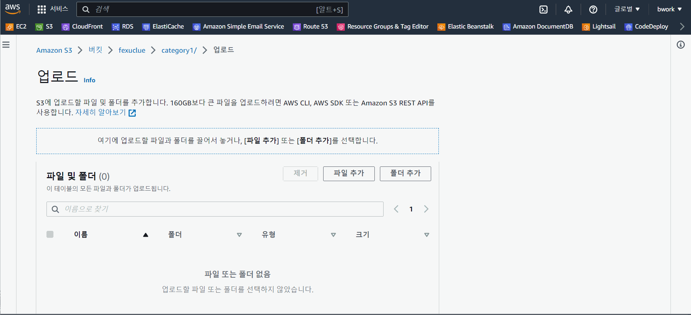

데이터, 이미지, PDF 업데이트 방법
 
1. aws 접속>콘솔에 로그인

* 계정정보는 메일 참고

2. 상단서비스중 S3 선택

3. 버킷 fexuclue 선택

4. 폴더,파일

> categorylist.json : 카테고리(화면 왼쪽 Benefit of P-CAB 등)

<pre>
[
  {
    "id": "category1",              -- 카테고리 고유값
    "text" : "Benefit of P-CAB"     -- 카테고리명
  }, {
    "id": "category2",
    "text" : "Value Proposition of Fexuprazan"
  }, {
    "id": "category3",
    "text" : "Publication & Scientific Congresses"
  }, {
    "id": "category4",
    "text" : "Global Statuss"
  }
]
</pre>
   
> list.json : 검색 리스트
<pre>
[
  {
    -- 고유값
    "id": "no_1",   
    -- 썸네일
    "thumbnail" : "https://fexuclue.s3.ap-northeast-2.amazonaws.com/category3/1.+%EC%8D%B8%EB%84%A4%EC%9D%BC.png",
    -- PDF
    "pdf" : "https://fexuclue.s3.ap-northeast-2.amazonaws.com/category3/1.+sunwoo2018.pdf",
    -- 카테고리 고유값
    "categoryId" : "category3",
    -- title
    "title" : "Safety, tolerability, pharmacodynamics and pharmacokinetics\n\nof fexuprazan in healthy male subjects",
    -- summary
    "content" : "SUNWOO J, et al. Aliment Pharmacol Ther. 2018;48(2):206-218."
  },
    ...
]
</pre>

> category1 : 1. Benefit of P-CAB의 썸네일, PDF 파일 폴더

> category2 : 2. Value Proposition of Fexuprazan의 썸네일, PDF 파일 폴더

> category3 : 3. Publication & Scientific Congresses의 썸네일, PDF 파일 폴더

> category4 : 4. Global Status의 썸네일, PDF 파일 폴더

5. 파일 업로드 및 정보 반영 방법

6. 파일 url 복사

7. 복사된 url 정보를 list.json에 작성

8. list.json 파일 업로드 하면 데이터 반영완료